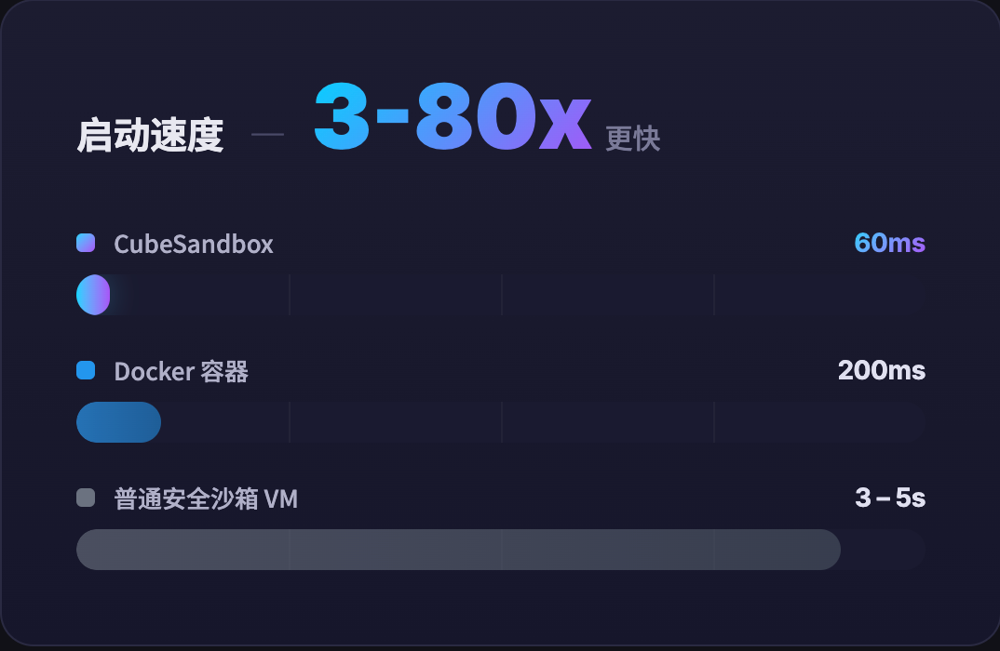
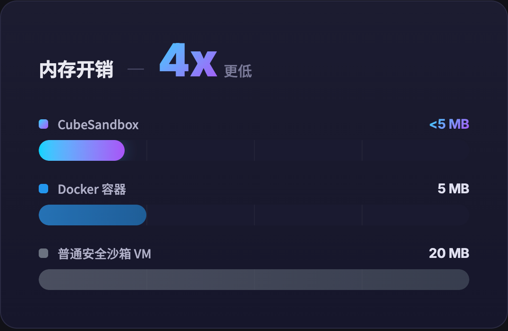
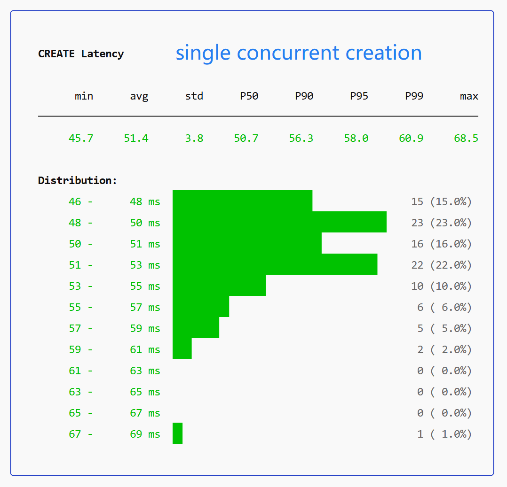
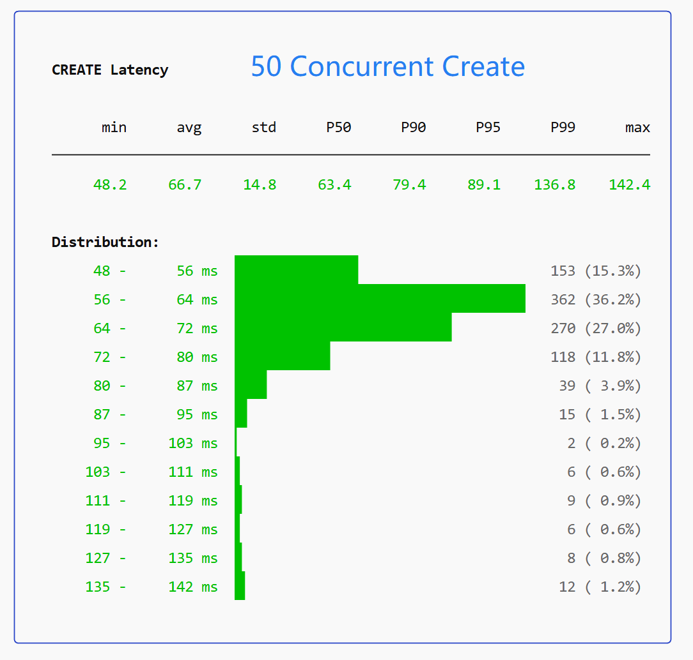
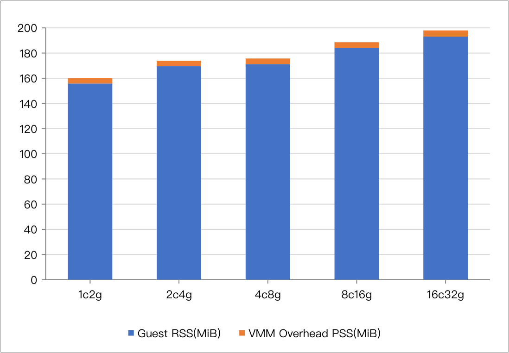
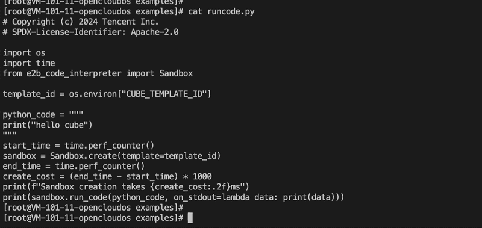
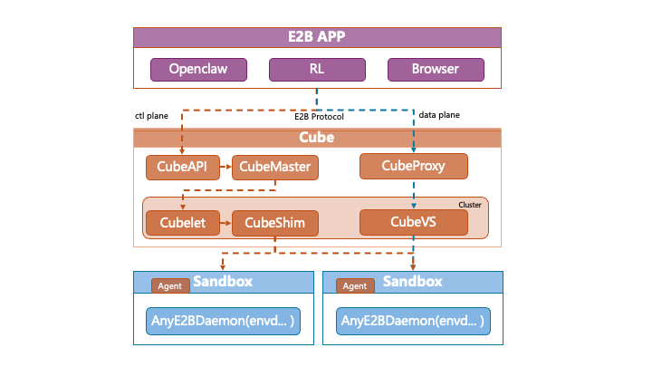

<p align="center">
  
</p>

<h1 align="center">CubeSandbox</h1>

<p align="center">
  <strong>一个极速启动、高并发、安全且轻量化的 AI Agent 沙箱</strong>
</p>

<p align="center">
  <a href="https://github.com/tencentcloud/CubeSandbox/stargazers"></a>
  <a href="https://github.com/tencentcloud/CubeSandbox/issues"></a>
  <a href="./LICENSE"></a>
  <a href="./CONTRIBUTING.md"></a>
</p>

<p align="center">
  
  
  
  
</p>

<p align="center">
  <a href="./README.md"><strong>English</strong></a> ·
  <a href="./docs/zh/guide/quickstart.md"><strong>快速开始</strong></a> ·
  <a href="./docs/zh/index.md"><strong>文档</strong></a> ·
  <a href="#wechat-group"><strong>微信交流群</strong></a>
</p>

---

Cube Sandbox 是一款基于 RustVMM 与 KVM 构建的高性能、开箱即用的安全沙箱服务。它既支持单机部署，也能够很方便的扩展到多台机器的集群服务。同时对外兼容E2B SDK， 在60ms内就可以创建一个具备服务能力的硬件隔离沙箱环境，并保持着小于5M的内存开销。


<p align="center">
  
  
</p>

## 核心优势

- **极致冷启动：** 基于资源池化预置和快照克隆技术，直接跳过耗时初始化流程。整个沙箱服务端到端冷启动一个可服务的沙箱时间平均 < 60ms
- **单机千例的高密部署：** 基于 CoW 技术实现极致内存复用，用 Rust 重构底层极致裁剪，使得单实例内存开销低至 <5MB，轻松在一台机器上跑起数千个 Agent。
- **真正的内核级隔离：** 告别不安全的 Docker 共享内核（Namespace）。每个 Agent 拥有独立的 Guest OS 内核，杜绝容器逃逸，放心运行任何大模型生成的未知代码。
- **零成本迁移（E2B 完美平替）：** 原生兼容 E2B SDK 接口规范。只需替换一个 URL 环境变量，无需业务代码改动就可切换到免费的 Cube Sandbox，并获得更好的性能体验。
- **网络安全：** 基于 eBPF 的 CubeVS 在内核态实现严格的沙箱间网络隔离，支持细粒度出站流量过滤策略。
- **开箱即用：** 可一键快速部署，同时支持单机部署和集群部署。
- **事件级快照回滚（coming soon）：** 百毫秒级的高频快照回滚能力，基于快照快速创建分叉探索环境
- **可用于生产环境：** Cube Sandbox 已在腾讯云生产环境中经历大规模的服务验证，稳定可靠。

## 性能与方案对比 (Benchmarks)

在 AI Agent 代码执行场景下，Cube Sandbox 实现了安全与性能的兼得：

| 维度 | Docker 容器 | 传统虚拟机 (VM) | CubeSandbox |
|---|---|---|---|
| **隔离级别** | 低 (共享内核 Namespaces) | 高 (独立内核) | **极高 (独立内核 + eBPF网络隔离)** |
| **启动速度** | 200ms | 分钟级 | **毫秒级 (< 60ms)** |
| **内存开销** | 低（共享内核） | 高 (完整 OS ) | **低 (极限裁剪，< 5MB)** |
| **部署密度** | 高 | 低 | **极高 (单机数千实例)** |
| **E2B SDK 兼容** | ❌ 不兼容 | ❌ 不兼容 | **✅ 完全兼容 (Drop-in)** |

> *Cube Sandbox 测试数据说明：其中，启动速度项基于裸金属环境测试，单并发下为 60ms，50 并发场景下平均 67ms（P95 90ms，P99 137ms），整体保持在百毫秒级。内存开销项基于 ≤ 32GB 规格沙箱实测，更大规格下开销会略有上升，但幅度极小。*

详细的创建时延和资源消耗情况可参考：


<table align="center">
  <tr align="center" valign="middle">
    <td width="33%" valign="middle">
      
    </td>
    <td width="33%" valign="middle">
      
    </td>
    <td width="33%" valign="middle">
      
    </td>
  </tr>
  <tr align="center" valign="top">
    <td colspan="2">
      <em>单 / 高并发场景下百毫秒级的沙箱交付</em>
    </td>
    <td>
      <em>不同规格沙箱 Cube Sandbox 自身内存消耗</em><br>
      <sup>*其中蓝色部分为沙箱规格，橙色部分为对应规格下消耗内存，随着规格扩大，内存消耗呈现少量增长</sup>
    </td>
  </tr>
</table>

## 快速开始

</br>

<p align="center">
  <a href="./docs/zh/guide/quickstart.md">
    
  </a>
</p>

<p align="center">
  <em>⚡ 毫秒级启动 —— 观看快速启动流程，然后进入<a href="./docs/zh/guide/quickstart.md" target="_blank">快速开始指南</a>。</em>
</p>

--- 

在具有KVM支持的机器上，三步启动你的第一个沙箱：

1. **启动Cube沙箱服务**

```bash
curl -sL https://github.com/tencentcloud/CubeSandbox/cube-sandbox/deploy/one-click/online-install.sh | bash
```

2. **制作代码解释器沙箱模板**

```bash
cubemastercli tpl create-from-image \
  --image ccr.ccs.tencentyun.com/ags-image/sandbox-code:latest \
  --writable-layer-size 1G \
  --expose-port 49999 \
  --expose-port 49983 \
  --probe 49999
```

3. **运行你的第一段 Agent 代码**

设置环境变量指向本地服务：`CUBE_TEMPLATE_ID`、`E2B_API_URL`、`E2B_API_KEY`，然后直接使用 E2B 的官方 SDK：

```bash
export E2B_API_URL="http://127.0.0.1:3000"
# Required: any non-empty value satisfies the SDK check
export E2B_API_KEY="dummy"
# Required: template ID obtained from Step2 (create-from-image)
export CUBE_TEMPLATE_ID="<your-template-id>"
export SSL_CERT_FILE="$(mkcert -CAROOT)/rootCA.pem"
```

```python
import os
from e2b_code_interpreter import Sandbox # 没错，直接用 E2B 的 SDK！

# CubeSandbox 在底层无缝接管了所有的请求
with Sandbox.create(template=os.environ["CUBE_TEMPLATE_ID"]) as sandbox:
    # 让大模型生成的代码在这里安全运行
    result = sandbox.run_code("print('Hello from Cube Sandbox, safely isolated!')")
    print(result)
```

想要探索更多玩法？查看 📂 [`examples/`](./examples/) 目录，涵盖：代码执行、Shell 命令、文件操作、浏览器自动化、网络策略、暂停/恢复、OpenClaw 集成、RL 训练等场景。

## 深入探索

- [文档首页](./docs/zh/index.md) — 完整指南导航
- [模板概览](./docs/zh/guide/templates.md) — 镜像到模板的概念与工作流
- [示例项目](./docs/zh/guide/tutorials/examples.md) — 展示各种使用场景的示例（涵盖代码执行、浏览器自动化、OpenClaw 集成与 RL 训练等）

## 架构概览



| 组件 | 职责 |
|---|---|
| **CubeAPI** | 兼容 E2B 的 REST API 网关（Rust），替换 URL 即可从 E2B 无缝切换。 |
| **CubeMaster** | 编排调度器，接收 API 请求并分发到对应 Cubelet，负责资源调度与集群状态维护。 |
| **CubeProxy** | 反向代理，兼容 E2B 协议，将请求路由到对应沙箱。 |
| **Cubelet** | 计算节点本地调度组件，管理单节点所有沙箱实例的完整生命周期。 |
| **CubeVS** | 基于 eBPF 内核态转发的虚拟交换机，提供网络隔离与安全策略支持。 |
| **CubeRuntime** | Cube 沙箱底层运行时，由 Shim、Hypervisor、Agent 协同构成。 |

详见[架构概览](./docs/zh/architecture/overview.md)和 [CubeVS 网络模型](./docs/zh/architecture/network.md)。

## 社区与贡献

我们欢迎各种形式的贡献——Bug 报告、功能建议、文档改进、代码提交。

- **发现 Bug** —— <a href="https://github.com/tencentcloud/CubeSandbox/issues" target="_blank">在这里报告问题或提出建议</a>
- **有新想法** — <a href="https://github.com/tencentcloud/CubeSandbox/discussions" target="_blank">提问交流与想法分享</a>
- **想写代码？** —  查看我们的 <a href="./CONTRIBUTING.md" target="_blank">CONTRIBUTING.md</a> 贡献指南，了解如何提交Pull Requst。
- **想聊聊天？** 扫描二维码，加入我们的微信交流群。


---

<a id="wechat-group"></a>
<p align="center">
  
</p>
<p align="center">
  <em>💬 扫描上方二维码加入微信交流群，与核心开发者和社区伙伴零距离沟通！</em>
</p>


## 许可证

Cube Sandbox 使用 [Apache License 2.0](./LICENSE) 开源许可证。

Cube Sandbox 的诞生离不开开源社区的基石，特别鸣谢 [Cloud Hypervisor](https://github.com/cloud-hypervisor/cloud-hypervisor)、[Kata Containers](https://github.com/kata-containers/kata-containers)、virtiofsd、containerd-shim-rs、ttrpc-rust 等。部分组件为适配 Cube Sandbox 运行模型进行了定制修改，原始上游归属声明均已保留。
